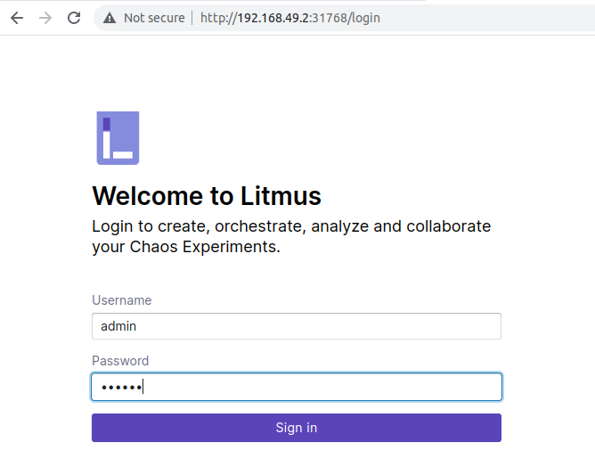

# WIP

### Why do we need litmus-chaos?

To help teams find problems and possible system breakdowns by safely running tests that create controlled chaos in their infrastructure. (1*)

### Prerequisites (2*)

- Kubernetes 1.17 or later (Let's install v1.25.14)

  - minikube (installation)
     - ```curl -LO https://storage.googleapis.com/minikube/releases/latest/minikube-linux-amd64```
     - ```sudo install minikube-linux-amd64 /usr/local/bin/minikube```
  - ```minikube start --memory 4096 --cpus 4 --kubernetes-version v1.25.14```
  - ```minikube addons enable metrics-server``` 

- A Persistent volume of 20GB

   - NOTE: Recommend to have a Persistent volume(PV) of 20GB, You can start with 1GB for test purposes as well. This PV is used as persistent storage to store the chaos config and chaos-metrics in the Portal. By default, litmus install would use the default storage class to allocate the PV. Provide this value

- Helm3 or kubectl

### Installation (2*)

- ```helm repo add litmuschaos https://litmuschaos.github.io/litmus-helm/```

- ```kubectl create ns litmus```

- ```helm install chaos litmuschaos/litmus --namespace=litmus --set portal.frontend.service.type=NodePort```


  - #### Verify the installation

    - ```kubectl get pods -n litmus```
       ```       
            NAME                                        READY   STATUS    
            chaos-litmus-auth-server-5547bf7468-jt9hp   1/1     Running  
            chaos-litmus-frontend-785b4fb4b9-shgcj      1/1     Running  
            chaos-litmus-server-8564d7db78-fm9rt        1/1     Running   
            chaos-mongodb-0                             1/1     Running  
            chaos-mongodb-1                             1/1     Running 
            chaos-mongodb-2                             1/1     Running 
            chaos-mongodb-arbiter-0                     1/1     Running 
       ``` 

    - ```kubectl get svc -n litmus```
       ```       
            NAME                               TYPE        CLUSTER-IP      EXTERNAL-IP   PORT(S)             
            chaos-litmus-auth-server-service   ClusterIP   10.109.151.50   <none>        9003/TCP,3030/TCP   
            chaos-litmus-frontend-service      NodePort    10.106.67.239   <none>        9091:31768/TCP      
            chaos-litmus-server-service        ClusterIP   10.100.151.95   <none>        9002/TCP,8000/TCP  
            chaos-mongodb-arbiter-headless     ClusterIP   None            <none>        27017/TCP       
            chaos-mongodb-headless             ClusterIP   None            <none>        27017/TCP           
       ```        

### Accessing the Litmus ChaosCenter

- Run ```kubectl get svc -n litmus``` and get port of ```the chaos-litmus-frontend-service```

- Run ```kubectl get nodes -o wide``` to get the IP address of the node.

```
kubectl get nodes -o wide
NAME       STATUS   ROLES           AGE   VERSION    INTERNAL-IP    EXTERNAL-IP   OS-IMAGE             KERNEL-VERSION      CONTAINER-RUNTIME
minikube   Ready    control-plane   57m   v1.25.14   192.168.49.2   <none>        Ubuntu 22.04.2 LTS   5.15.0-84-generic   docker://24.0.4
```

- Access ```http://<IP-of-NODE>:<PORT-of-chaos-litmus-frontend-service>``` , for my installation it was http://192.168.49.2:31768


  -  
  - The default credentials are:
     - Username: admin
     - Password: litmus

### Test (Chaos Experiments)


### Resources
1*. https://litmuschaos.io/

2*. https://docs.litmuschaos.io/docs/getting-started/installation